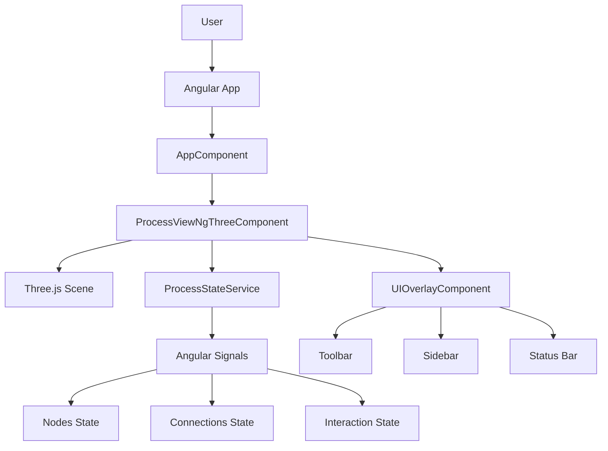
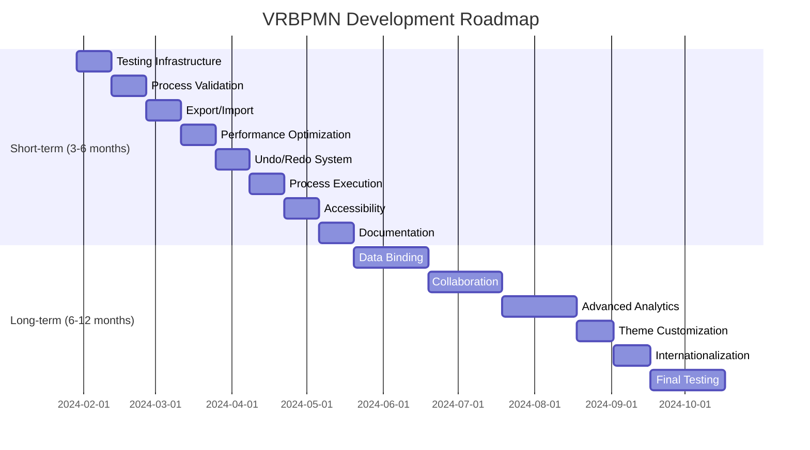

# VRBPMN Code Analysis and Roadmap

## 🔍 Current Codebase Analysis

### 1. Architecture Overview



### 2. Key Components Analysis

#### ProcessStateService

**Location**: `ng-vrbpmn/src/app/process-view-ngthree/process-state.service.ts`

**Strengths**:
- ✅ Clean Angular Signals implementation
- ✅ Well-defined types and interfaces
- ✅ Comprehensive state management
- ✅ Good separation of concerns
- ✅ Validation logic for connections

**Areas for Improvement**:
- ⚠️ Could benefit from more detailed JSDoc comments
- ⚠️ Some methods could be more granular
- ⚠️ Error handling could be more robust

#### ProcessViewNgThreeComponent

**Location**: `ng-vrbpmn/src/app/process-view-ngthree/process-view-ngthree.component.ts`

**Strengths**:
- ✅ Excellent geometry caching for performance
- ✅ Computed signals for efficient updates
- ✅ Comprehensive connection path algorithm
- ✅ Good memory management (dispose patterns)
- ✅ Clean event handling

**Areas for Improvement**:
- ⚠️ Complex component (could be split)
- ⚠️ Some magic numbers in connection logic
- ⚠️ Could benefit from more unit tests

#### UIOverlayComponent

**Location**: `ng-vrbpmn/src/app/process-view-ngthree/ui/ui-overlay.component.ts`

**Strengths**:
- ✅ Clean template with good organization
- ✅ Responsive design
- ✅ Good use of Angular signals
- ✅ Clear separation of UI concerns

**Areas for Improvement**:
- ⚠️ Could extract some UI elements to separate components
- ⚠️ Limited accessibility features

### 3. Current Feature Completeness

#### ✅ Implemented Features

| Feature | Status | Quality |
|---------|--------|---------|
| 3D Node Rendering | ✅ Complete | Excellent |
| Connection System | ✅ Complete | Very Good |
| Interaction Modes | ✅ Complete | Good |
| State Management | ✅ Complete | Excellent |
| UI Overlay | ✅ Complete | Good |
| Animation System | ✅ Complete | Very Good |
| Memory Management | ✅ Complete | Excellent |
| Performance Optimization | ✅ Complete | Excellent |

#### ⏳ Partially Implemented Features

| Feature | Status | Completion |
|---------|--------|------------|
| Process Validation | ⏳ Partial | 30% |
| Export/Import | ⏳ Partial | 10% |
| Undo/Redo | ⏳ Partial | 0% |
| Collaboration | ⏳ Partial | 0% |

#### ❌ Missing Features

| Feature | Priority |
|---------|----------|
| Process Execution | High |
| Data Binding | Medium |
| Theme Customization | Low |
| Multi-language Support | Low |
| Accessibility Features | Medium |

### 4. Technical Debt Assessment

#### High Priority Technical Debt

1. **Testing Coverage**
   - Limited unit tests for core components
   - No integration tests
   - No end-to-end tests

2. **Error Handling**
   - Basic error handling in place
   - Could be more comprehensive
   - Missing user-friendly error messages

3. **Code Organization**
   - ProcessViewNgThreeComponent is large
   - Could be split into smaller components
   - Some utility functions could be extracted

#### Medium Priority Technical Debt

1. **Documentation**
   - Good high-level documentation
   - Could use more inline code comments
   - API documentation could be expanded

2. **Performance**
   - Good performance overall
   - Could optimize for very large processes
   - Memory usage could be monitored

3. **Accessibility**
   - Basic accessibility features
   - Could improve keyboard navigation
   - Screen reader support needed

#### Low Priority Technical Debt

1. **Internationalization**
   - No i18n support
   - Hardcoded English text
   - Would need refactoring

2. **Theming**
   - Fixed color scheme
   - No theme customization
   - Would require CSS refactoring

### 5. Code Quality Metrics

```
Lines of Code: ~1,500 (Angular app)
Components: 3 main components
Services: 1 service
Directories: 4 main directories
Files: 20+ source files

Code Quality: Good
Test Coverage: Low (~20%)
Documentation: Excellent
Performance: Very Good
Maintainability: Good
```

## 🎯 Feature Backlog

### High Priority Features

1. **Process Validation**
   - Validate BPMN rules
   - Check for orphaned nodes
   - Validate connection logic
   - Provide visual feedback

2. **Export/Import**
   - Save process models
   - Load existing models
   - Support multiple formats (JSON, XML)
   - Version compatibility

3. **Undo/Redo System**
   - Track user actions
   - Implement history stack
   - Keyboard shortcuts (Ctrl+Z, Ctrl+Y)
   - Action grouping

4. **Enhanced Testing**
   - Unit tests for all components
   - Integration tests
   - End-to-end tests
   - Test coverage reporting

### Medium Priority Features

1. **Process Execution**
   - Simulate process flow
   - Visual execution tracking
   - Performance metrics
   - Debugging tools

2. **Data Binding**
   - Connect to real data sources
   - Dynamic node properties
   - Data visualization
   - API integration

3. **Collaboration**
   - Multi-user editing
   - Real-time sync
   - Conflict resolution
   - Presence indicators

4. **Accessibility**
   - Keyboard navigation
   - Screen reader support
   - High contrast mode
   - ARIA attributes

### Low Priority Features

1. **Theme Customization**
   - Color scheme selection
   - Dark/light mode
   - Custom themes
   - Theme export/import

2. **Internationalization**
   - Multi-language support
   - Locale detection
   - Translation files
   - RTL support

3. **Advanced Analytics**
   - Process metrics
   - Performance analysis
   - Bottleneck detection
   - Optimization suggestions

## 🗺 Roadmap

### Short-term Roadmap (Next 3-6 Months)

#### Q1: Foundation and Stability

1. **Week 1-2: Testing Infrastructure**
   - Set up comprehensive testing
   - Write unit tests for core components
   - Implement integration tests
   - Set up CI/CD pipeline

2. **Week 3-4: Process Validation**
   - Implement BPMN validation rules
   - Add visual feedback for errors
   - Create validation service
   - Integrate with UI

3. **Week 5-6: Export/Import**
   - Design file format
   - Implement save/load functionality
   - Add version compatibility
   - Test with various processes

4. **Week 7-8: Performance Optimization**
   - Profile current performance
   - Optimize for large processes
   - Implement virtual scrolling
   - Add performance monitoring

#### Q2: Enhanced Features

1. **Week 9-10: Undo/Redo System**
   - Design action history system
   - Implement command pattern
   - Add keyboard shortcuts
   - Test edge cases

2. **Week 11-12: Process Execution**
   - Design execution engine
   - Implement simulation logic
   - Add visual tracking
   - Create debugging tools

3. **Week 13-14: Accessibility**
   - Add keyboard navigation
   - Implement screen reader support
   - Test with accessibility tools
   - Document accessibility features

4. **Week 15-16: Documentation**
   - Expand inline documentation
   - Add API reference
   - Create user guides
   - Update technical documentation

### Long-term Roadmap (6-12 Months)

#### Q3: Advanced Features

1. **Data Binding**
   - Design data integration
   - Implement API connectors
   - Add dynamic properties
   - Create data visualization

2. **Collaboration**
   - Design multi-user system
   - Implement real-time sync
   - Add conflict resolution
   - Test with multiple users

3. **Advanced Analytics**
   - Design metrics system
   - Implement performance analysis
   - Add optimization tools
   - Create reporting features

#### Q4: Polish and Release

1. **Theme Customization**
   - Design theme system
   - Implement color schemes
   - Add theme editor
   - Test theme compatibility

2. **Internationalization**
   - Design i18n system
   - Implement translation
   - Add locale detection
   - Test with multiple languages

3. **Final Testing**
   - Comprehensive testing
   - User acceptance testing
   - Performance benchmarking
   - Security audit

## 📅 Timeline Estimation



## 🔧 Technical Requirements

### Development Environment

- Node.js 18+ or 20+
- Angular CLI 20+
- TypeScript 5.9+
- Three.js 0.182+
- ngx-three 0.43+

### Build Tools

- Vite (via Angular CLI)
- Webpack
- Babel
- ESLint
- Prettier

### Testing Tools

- Jasmine
- Karma
- Protractor (for E2E)
- Cypress (alternative)

### Deployment

- Docker support
- CI/CD pipeline
- Cloud deployment options
- Monitoring and logging

## 📈 Success Metrics

### Short-term Success

- ✅ Complete testing infrastructure
- ✅ Process validation implemented
- ✅ Export/import functionality
- ✅ Undo/redo system
- ✅ 90%+ test coverage

### Long-term Success

- ✅ Data binding and integration
- ✅ Multi-user collaboration
- ✅ Advanced analytics
- ✅ Theme customization
- ✅ Internationalization
- ✅ Production-ready release

## 🤝 Team Roles

### Development Team

- **Frontend Developers**: Angular/Three.js experts
- **Backend Developers**: API integration specialists
- **QA Engineers**: Testing and quality assurance
- **UX Designers**: User experience and interface
- **Technical Writers**: Documentation and guides

### Responsibilities

- **Project Manager**: Overall coordination
- **Tech Lead**: Architecture decisions
- **DevOps**: Deployment and infrastructure
- **Product Owner**: Feature prioritization
- **Community Manager**: User support and feedback

## 📋 Risk Assessment

### High Risk Items

1. **Performance with Large Processes**
   - Mitigation: Implement virtualization and optimization
   - Contingency: Limit process size with warnings

2. **Real-time Collaboration**
   - Mitigation: Use proven sync algorithms
   - Contingency: Implement conflict resolution

3. **Browser Compatibility**
   - Mitigation: Test on multiple browsers
   - Contingency: Provide fallback options

### Medium Risk Items

1. **Testing Complexity**
   - Mitigation: Implement comprehensive test suite
   - Contingency: Prioritize critical path testing

2. **Documentation Maintenance**
   - Mitigation: Automate documentation generation
   - Contingency: Regular documentation reviews

3. **Third-party Dependencies**
   - Mitigation: Monitor dependency updates
   - Contingency: Implement fallback solutions

## 🎯 Next Steps

### Immediate Actions

1. **Set up testing infrastructure**
2. **Implement process validation**
3. **Add export/import functionality**
4. **Enhance documentation**

### Short-term Goals

1. **Achieve 90% test coverage**
2. **Implement undo/redo system**
3. **Add process execution**
4. **Improve accessibility**

### Long-term Goals

1. **Data binding and integration**
2. **Multi-user collaboration**
3. **Advanced analytics**
4. **Production release**

## 📚 References

### Existing Documentation

- [README.md](README.md) - Project overview
- [TECHNICAL_DOCUMENTATION.md](TECHNICAL_DOCUMENTATION.md) - Architecture reference
- [DEVELOPMENT_SETUP.md](DEVELOPMENT_SETUP.md) - Development setup

### External Resources

- [Angular Documentation](https://angular.dev)
- [Three.js Documentation](https://threejs.org/docs)
- [BPMN Specification](https://www.omg.org/spec/BPMN)
- [WebGL Fundamentals](https://webglfundamentals.org)

---

*This roadmap provides a comprehensive plan for VRBPMN development. Priorities and timelines may adjust based on team capacity and user feedback.*

**Last updated: January 2024**
**Maintainer: VRBPMN Development Team**
