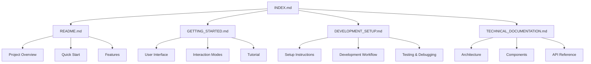

# VRBPMN Documentation Summary

## 📚 Documentation Overview

This summary provides an overview of the comprehensive documentation created for the VRBPMN project.

## 📁 Documentation Files Created

### 1. **README.md** (6,737 bytes)
**Purpose**: Main project overview and quick start guide
**Audience**: Everyone (users, developers, contributors)
**Key Contents**:
- Project description and features
- Quick start instructions
- Technology stack and dependencies
- Architecture overview
- Node types and connection system
- Browser support and license information

### 2. **GETTING_STARTED.md** (8,762 bytes)
**Purpose**: User guide and tutorial
**Audience**: End users and new contributors
**Key Contents**:
- Installation and launch instructions
- User interface overview with ASCII diagram
- Basic concepts (nodes, connections)
- Interaction modes tutorial (MOVE, ADD, LINK, DELETE)
- Step-by-step guide to creating first process
- Tips, tricks, and troubleshooting
- Example process flows

### 3. **DEVELOPMENT_SETUP.md** (12,625 bytes)
**Purpose**: Developer environment setup and workflow
**Audience**: Developers and contributors
**Key Contents**:
- System requirements and prerequisites
- Installation and verification steps
- Project structure explanation
- Configuration details (Angular, TypeScript, Prettier)
- Development workflow and commands
- Testing strategy and coverage
- Build and deployment instructions
- Debugging techniques and tools
- VS Code setup and extensions
- Code style guide and best practices
- Continuous integration setup

### 4. **TECHNICAL_DOCUMENTATION.md** (15,399 bytes)
**Purpose**: Deep technical dive into architecture
**Audience**: Developers, architects, advanced users
**Key Contents**:
- Architecture overview with Mermaid diagrams
- Core components documentation
- Data flow diagrams
- Configuration system explanation
- Performance optimization techniques
- Interaction system details
- Visual effects implementation
- Build and deployment processes
- Testing strategy
- Error handling approaches
- Future enhancements roadmap
- API reference
- Migration guide from prototypes
- Glossary of terms

### 5. **INDEX.md** (7,906 bytes)
**Purpose**: Documentation hub and navigation guide
**Audience**: Everyone needing to find information
**Key Contents**:
- Documentation guide by role (users, developers, contributors)
- Quick links to essential reading
- Navigation guide by topic
- File structure overview
- Search guide with common terms
- Documentation roadmap
- Contribution guidelines
- Support and community information
- Quick reference for commands and files
- Checklists for new users and developers

## 📊 Documentation Statistics

```
Total Files: 5
Total Size: ~51 KB
Total Lines: ~2,500+
Coverage: Comprehensive (user guide, developer setup, technical docs, navigation)
```

## 🎯 Documentation Architecture



## 🗺 Navigation Flow

### For New Users
```
INDEX.md → GETTING_STARTED.md → README.md → (explore application)
```

### For New Developers
```
INDEX.md → README.md → DEVELOPMENT_SETUP.md → TECHNICAL_DOCUMENTATION.md → (start coding)
```

### For Advanced Users
```
INDEX.md → TECHNICAL_DOCUMENTATION.md → (specific sections as needed)
```

## 🎨 Documentation Features

### 1. **Comprehensive Coverage**
- User guides, developer setup, technical deep dives
- From beginner tutorials to advanced architecture
- Covers all aspects of the project

### 2. **Multiple Formats**
- Markdown for easy reading and editing
- Code blocks with syntax highlighting
- ASCII diagrams for visual representation
- Mermaid diagrams for architecture visualization
- Tables for organized information

### 3. **Practical Examples**
- Step-by-step tutorials
- Code snippets and examples
- Real-world use cases
- Troubleshooting guides

### 4. **Navigation Aids**
- Cross-references between documents
- Search guides with common terms
- Checklists for onboarding
- Quick reference sections

### 5. **Best Practices**
- Consistent formatting and style
- Clear, concise language
- Logical organization
- Up-to-date information
- Version control integration

## 🔍 Key Information Location

| Topic | Best Documentation File |
|-------|------------------------|
| Project Overview | README.md |
| First Time Setup | GETTING_STARTED.md |
| Development Environment | DEVELOPMENT_SETUP.md |
| Architecture Details | TECHNICAL_DOCUMENTATION.md |
| Finding Information | INDEX.md |
| Interaction Modes | GETTING_STARTED.md |
| State Management | TECHNICAL_DOCUMENTATION.md |
| Performance Optimization | TECHNICAL_DOCUMENTATION.md |
| Testing Strategy | DEVELOPMENT_SETUP.md |
| Deployment | DEVELOPMENT_SETUP.md |

## 📈 Documentation Quality Metrics

### Completeness
- ✅ Project overview and features
- ✅ Installation and setup instructions
- ✅ User interface documentation
- ✅ Interaction modes explanation
- ✅ Architecture and components
- ✅ API reference
- ✅ Performance optimization
- ✅ Troubleshooting guides
- ✅ Best practices
- ✅ Future roadmap

### Accessibility
- ✅ Clear language and organization
- ✅ Cross-references between documents
- ✅ Searchable content
- ✅ Multiple navigation paths
- ✅ Checklists for onboarding

### Maintainability
- ✅ Markdown format (easy to edit)
- ✅ Version control integration
- ✅ Consistent style and formatting
- ✅ Modular organization
- ✅ Update-friendly structure

## 🤝 Contribution Guide

### How to Improve Documentation

1. **Report Issues**: Open GitHub issues for missing or unclear information
2. **Suggest Improvements**: Propose changes via pull requests
3. **Add Examples**: Contribute real-world use cases and scenarios
4. **Update Content**: Keep information current with project changes
5. **Translate**: Help translate documentation to other languages

### Documentation Standards

```markdown
# Use clear, hierarchical headings

## Section Headings

### Subsection Headings

#### Detailed Topics

- Use bullet points for lists
- Keep paragraphs concise
- Use code blocks for examples
- Include cross-references where helpful
- Maintain consistent formatting
```

## 📬 Support Resources

### Getting Help

1. **Start with INDEX.md** for navigation
2. **Check specific documentation** for your topic
3. **Search across documents** using grep or find
4. **Review prototypes** for historical context
5. **Examine source code** for implementation details

### Reporting Documentation Issues

When reporting issues:
1. Specify which document needs improvement
2. Describe what information is missing or unclear
3. Suggest how it could be improved
4. Provide examples if helpful
5. Reference related issues or discussions

## 🎯 Future Documentation Plans

### Planned Additions

1. **Advanced Features Guide**: Deep dive into complex features
2. **Customization Guide**: Theming and configuration options
3. **Integration Guide**: Connecting with other systems
4. **Performance Tuning**: Advanced optimization techniques
5. **Contribution Guidelines**: Detailed contribution process
6. **Release Notes**: Version history and changelog
7. **FAQ**: Frequently asked questions
8. **Video Tutorials**: Visual walkthroughs

### Continuous Improvement

- Regular updates with new features
- Community feedback integration
- Documentation reviews and audits
- Translation to multiple languages
- Accessibility improvements

## 📋 Documentation Checklist

### For Documentation Contributors

- [ ] Read existing documentation thoroughly
- [ ] Understand project architecture and features
- [ ] Follow documentation standards and style
- [ ] Use clear, concise language
- [ ] Include practical examples where helpful
- [ ] Cross-reference related documentation
- [ ] Keep information up-to-date
- [ ] Test documentation with real users
- [ ] Gather and incorporate feedback
- [ ] Maintain version control history

### For Documentation Reviewers

- [ ] Verify accuracy of technical information
- [ ] Check for completeness and coverage
- [ ] Ensure consistent style and formatting
- [ ] Validate examples and code snippets
- [ ] Confirm cross-references are correct
- [ ] Test instructions and tutorials
- [ ] Check for accessibility and readability
- [ ] Ensure proper version control
- [ ] Verify links and references work
- [ ] Confirm documentation matches current implementation

## 🔗 Quick Reference

### Essential Files

```
README.md                    # Start here for project overview
GETTING_STARTED.md           # User guide and tutorial
DEVELOPMENT_SETUP.md         # Developer setup instructions
TECHNICAL_DOCUMENTATION.md   # Architecture and API reference
INDEX.md                     # Documentation hub and navigation
```

### Common Commands

```bash
# View all documentation files
ls *.md

# Search for specific topics
grep -r "interaction mode" *.md

# Open documentation in default editor
xdg-open GETTING_STARTED.md

# Count words in documentation
wc -w *.md
```

## 📊 Summary Statistics

```
Documentation Files: 5
Total Size: ~51 KB
Total Lines: ~2,500+
Coverage: Comprehensive
Format: Markdown
Style: Consistent and professional
Organization: Logical and navigable
```

---

*This documentation summary provides an overview of the comprehensive documentation suite created for VRBPMN. For specific information, please refer to the individual documentation files.*

**Documentation is a living resource - help us improve it!** 📚

*VRBPMN Documentation Team*
*Last updated: January 2024*
