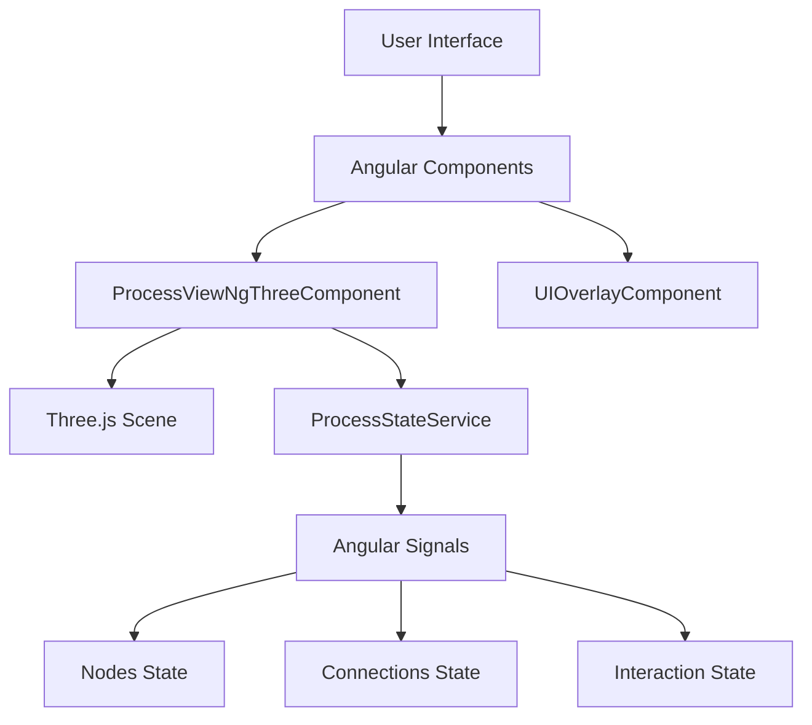
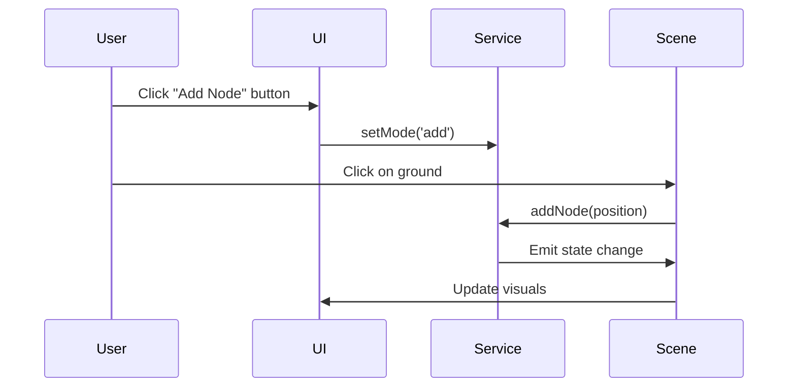
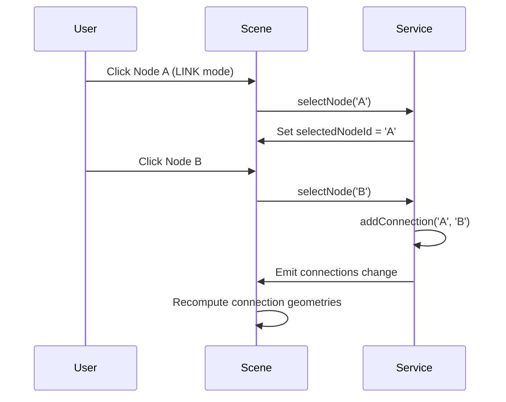

# VRBPMN - Technical Documentation

## Architecture Overview

### System Components



## Core Components

### 1. ProcessStateService

**Location**: `src/app/process-view-ngthree/process-state.service.ts`

**Responsibilities**:
- Central state management using Angular Signals
- Node CRUD operations (Create, Read, Update, Delete)
- Connection management
- Interaction mode tracking
- Selection and hover state management

**Key Methods**:

```typescript
// State management
public interactionMode = signal<InteractionMode>('move');
public currentNodeType = signal<NodeType>('usertask');
public selectedNodeId = signal<string | null>(null);

// Node operations
public addNode(position: THREE.Vector3): void
public moveNode(id: string, position: THREE.Vector3): void
public deleteNode(id: string): void

// Connection operations
public addConnection(sourceId: string, targetId: string): void
public deleteConnection(id: string): void

// Interaction handlers
public selectNode(id: string): void
public hoverNode(id: string | null, isHovered: boolean): void
```

**Node Types**:
```typescript
export type NodeType = 'start' | 'usertask' | 'servicetask' | 'xgateway' | 'pgateway' | 'terminal';
```

### 2. ProcessViewNgThreeComponent

**Location**: `src/app/process-view-ngthree/process-view-ngthree.component.ts`

**Responsibilities**:
- 3D scene rendering using Three.js
- Node visualization with different geometries
- Connection path computation
- Mouse interaction handling
- Animation and visual effects

**Key Features**:

#### Geometry Caching
```typescript
private geometryCache = new Map<string, THREE.BufferGeometry>();

public connectionGeometries = computed(() => {
  // Dispose unused geometries
  // Create or reuse geometries for connections
});
```

#### Connection Path Algorithm
```typescript
private computeConnPath(conn: Connection, nodes: Node[]): THREE.CurvePath<THREE.Vector3> {
  // Calculate optimal path between nodes
  // Handle straight lines for close nodes
  // Create rounded corners for distant nodes
  // Return THREE.CurvePath for rendering
}
```

#### Animation System
```typescript
onNodeRender(event: any, nodeId: string) {
  // Apply rotation based on time
  // Add hover effects (bouncing, faster rotation)
  // Smooth transitions using THREE.MathUtils.lerp
}
```

### 3. UIOverlayComponent

**Location**: `src/app/process-view-ngthree/ui/ui-overlay.component.ts`

**Responsibilities**:
- User interface controls
- Mode selection toolbar
- Property sidebar
- Status bar
- Modal dialogs

**UI Structure**:
- **Toolbar**: Left-side vertical buttons for mode selection
- **Sidebar**: Right-side panel with node properties
- **Status Bar**: Bottom bar showing system messages
- **Modal**: Detailed node information popup

## Data Flow

### State Management Flow



### Connection Creation Flow



## Configuration System

### Constants Structure

**Location**: `src/app/process-view-ngthree/process-view.constants.ts`

```typescript
// Scene Configuration
export const SCENE_CONFIG = {
    GROUND_Y: -1.5,
    GROUND_OFFSET: 0.01,
    GRID_OPACITY: 0.5,
    FOG_NEAR: 5,
    FOG_FAR: 25,
} as const;

// Connection Configuration
export const CONNECTION_CONFIG = {
    Y_POSITION: SCENE_CONFIG.GROUND_Y + SCENE_CONFIG.GROUND_OFFSET,
    CORNER_RADIUS: 0.5,
    NODE_OFFSET: 0.75,
    MIN_DISTANCE_FOR_CORNER: 1.0,
    PATH_SEGMENTS: 20,
    // ...
} as const;

// Colors
export const COLORS = {
    CYAN: new THREE.Color('#00f2ff'),
    HIGHLIGHT: new THREE.Color('#414e5c'),
    BLACK: new THREE.Color('#000000'),
    // ...
} as const;
```

## Performance Optimization Techniques

### 1. Geometry Caching

```typescript
// Cache connection geometries to avoid recreation
private geometryCache = new Map<string, THREE.BufferGeometry>();

// Only create new geometry when needed
let geom = this.geometryCache.get(conn.id);
if (!geom) {
    geom = new THREE.BufferGeometry().setFromPoints(...);
    this.geometryCache.set(conn.id, geom);
}
```

### 2. Computed Signals

```typescript
// Only recalculate when dependencies change
public connectionGeometries = computed(() => {
    const conns = this.state.allConnections();
    const nodes = this.state.allNodes();
    // ... computation
});
```

### 3. Memory Management

```typescript
ngOnDestroy() {
    // Dispose all cached geometries
    this.geometryCache.forEach(geom => geom.dispose());
    this.geometryCache.clear();
    
    // Dispose grid resources
    this.grid.geometry?.dispose();
    if (this.grid.material instanceof THREE.Material) {
        this.grid.material.dispose();
    }
}
```

### 4. Efficient Rendering

```typescript
// Use Three.js instanced meshes for similar objects
// Limit the number of draw calls
// Use appropriate material types (MeshBasicMaterial for static objects)
```

## Interaction System

### Mouse Event Handling

```typescript
// Canvas click handler
onCanvasClick(event: any) {
    if (this.state.interactionMode() === 'add') {
        const intersect = event.intersects?.[0];
        if (intersect && intersect.object.name === 'ground') {
            this.state.addNode(intersect.point);
        }
    }
}

// Node interaction handler
onNodeDown(event: any, nodeId: string) {
    this.state.selectNode(nodeId);
}

// Mouse move handler for dragging
onMouseMove(event: any) {
    const draggedId = this.state.draggedNodeId();
    if (draggedId && event.intersects) {
        const groundIntersect = event.intersects.find((i: any) => i.object.name === 'ground');
        if (groundIntersect) {
            const pos = groundIntersect.point.clone();
            pos.y = 0;
            pos.x = Math.round(pos.x);
            pos.z = Math.round(pos.z);
            this.state.moveNode(draggedId, pos);
        }
    }
}
```

### Interaction Modes

| Mode | Description | Behavior |
|------|-------------|----------|
| `move` | Default mode | Drag nodes, select nodes |
| `add` | Add new nodes | Click ground to add nodes of selected type |
| `link` | Create connections | Click source node, then target node |
| `delete` | Remove elements | Click nodes or connections to delete |

## Visual Effects

### Node Materials

```typescript
// Glass-like material for nodes
<th-mesh-physical-material
    [color]="selected ? COLORS.HIGHLIGHT : COLORS.BLACK"
    [metalness]="0.1"
    [roughness]="0.4"
    [transmission]="0.5"
    [thickness]="1.0"
    [transparent]="true"
    [emissive]="selected ? COLORS.CYAN : COLORS.DARK_GRAY"
    [emissiveIntensity]="selected ? 2 : 1"
    [opacity]="0.7">
</th-mesh-physical-material>
```

### Connection Visuals

```typescript
// Line material with transparency
<th-line-basic-material
    [color]="COLORS.CYAN"
    [transparent]="true"
    [opacity]="hovered ? 1.0 : 0.5">
</th-line-basic-material>

// Arrowhead with emissive glow
<th-mesh-standard-material
    [color]="COLORS.CYAN"
    [emissive]="COLORS.CYAN"
    [emissiveIntensity]="2">
</th-mesh-standard-material>
```

### Animation Effects

```typescript
// Hover animation
if (isHovered) {
    group.rotation.y += NODE_CONFIG.HOVER_ROTATION_SPEED;
    group.position.y = Math.sin(time * NODE_CONFIG.HOVER_BOUNCE_SPEED) 
                      * NODE_CONFIG.HOVER_BOUNCE_AMPLITUDE;
} else {
    group.position.y = THREE.MathUtils.lerp(group.position.y, 0, 0.1);
}

// Base rotation
group.rotation.y += NODE_CONFIG.BASE_ROTATION_SPEED;
```

## Build & Deployment

### Development Build

```bash
ng serve
# or
ng serve --configuration development
```

### Production Build

```bash
ng build
# or for optimized production build
ng build --configuration production
```

### Build Output Structure

```
dist/ng-vrbpmn/
├── browser/
│   ├── index.html
│   ├── main-*.js
│   ├── polyfills-*.js
│   ├── styles-*.css
│   └── assets/
├── 3rdpartylicenses.txt
└── prerendered-routes.json
```

## Testing Strategy

### Unit Testing

```bash
ng test
```

Tests are located alongside components with `.spec.ts` extension.

### End-to-End Testing

```bash
ng e2e
```

E2E tests should cover:
- Node creation and deletion
- Connection management
- Mode switching
- Camera controls

## Error Handling

### Validation Rules

```typescript
// Connection validation
if (targetNode.type === 'start') {
    this.statusMessage.set('Start node cannot have incoming connections');
    return;
}
if (sourceNode.type === 'terminal') {
    this.statusMessage.set('Terminal node cannot have outgoing connections');
    return;
}

// Duplicate prevention
const existing = this.connections().find(c => c.sourceId === sourceId && c.targetId === targetId);
if (existing) return;
```

### Status Messaging

```typescript
// Real-time feedback
this.statusMessage.set(`Added ${type} at ${position.x.toFixed(1)}, ${position.z.toFixed(1)}`);
this.statusMessage.set(`Connected ${sourceId} to ${targetId}`);
this.statusMessage.set(`Deleted Node ${id}`);
```

## Future Enhancements

### Planned Features

1. **Process Execution**: Simulate process flow through nodes
2. **Data Binding**: Connect nodes to real business data
3. **Collaboration**: Multi-user editing and real-time sync
4. **Export/Import**: Save and load process models
5. **Validation**: BPMN rule validation
6. **Themes**: Customizable color schemes
7. **Undo/Redo**: History tracking
8. **Performance Metrics**: Monitor rendering performance

### Technical Improvements

1. **Web Workers**: Offload heavy computations
2. **Level of Detail**: Adaptive quality based on distance
3. **Occlusion Culling**: Only render visible objects
4. **WebGL 2.0**: Enhanced rendering capabilities
5. **WebXR Support**: Virtual reality integration

## Troubleshooting

### Common Issues

**Issue**: Nodes not rendering
- **Cause**: Missing Three.js dependencies
- **Solution**: Run `npm install` and ensure `three` and `ngx-three` are installed

**Issue**: Performance lag with many nodes
- **Cause**: Too many draw calls
- **Solution**: Implement instanced rendering for similar nodes

**Issue**: Connections not updating
- **Cause**: Signal not triggering recomputation
- **Solution**: Check computed signal dependencies

**Issue**: Mouse interactions not working
- **Cause**: CSS pointer-events or z-index issues
- **Solution**: Check overlay CSS and ensure proper event propagation

## Best Practices

### Code Organization

1. **Component Responsibility**: Keep components focused on single responsibilities
2. **State Management**: Use signals for reactive state
3. **Type Safety**: Use TypeScript interfaces for data structures
4. **Error Handling**: Provide meaningful error messages

### Performance Tips

1. **Minimize Draw Calls**: Batch similar objects
2. **Use Instanced Meshes**: For repeated geometries
3. **Dispose Resources**: Clean up Three.js objects
4. **Limit Updates**: Only recalculate when necessary

### Debugging Techniques

1. **Three.js Inspector**: Use browser extensions to visualize scene
2. **Angular DevTools**: Monitor component hierarchy and state
3. **Performance Profiler**: Identify rendering bottlenecks
4. **Console Logging**: Strategic logging for state changes

## API Reference

### ProcessStateService Methods

| Method | Parameters | Returns | Description |
|--------|------------|---------|-------------|
| `setMode` | `mode: InteractionMode` | `void` | Set interaction mode |
| `setNodeType` | `type: NodeType` | `void` | Set node type for ADD mode |
| `addNode` | `position: THREE.Vector3` | `void` | Add new node at position |
| `moveNode` | `id: string, position: THREE.Vector3` | `void` | Move existing node |
| `deleteNode` | `id: string` | `void` | Remove node and its connections |
| `addConnection` | `sourceId: string, targetId: string` | `void` | Create connection between nodes |
| `deleteConnection` | `id: string` | `void` | Remove connection |
| `selectNode` | `id: string` | `void` | Select node (behavior depends on mode) |
| `hoverNode` | `id: string | null, isHovered: boolean` | `void` | Update hover state |

### ProcessViewNgThreeComponent Methods

| Method | Parameters | Returns | Description |
|--------|------------|---------|-------------|
| `isRound` | `type: NodeType` | `boolean` | Check if node type uses round geometry |
| `onNodeDown` | `event: any, nodeId: string` | `void` | Handle node click |
| `onNodeRender` | `event: any, nodeId: string` | `void` | Apply node animations |
| `onLabelClick` | `event: MouseEvent, nodeId: string` | `void` | Handle label click |
| `computeConnPath` | `conn: Connection, nodes: Node[]` | `THREE.CurvePath<THREE.Vector3>` | Calculate connection path |
| `getConnGeometry` | `conn: Connection` | `THREE.BufferGeometry` | Get connection geometry |
| `getArrowPos` | `conn: Connection` | `THREE.Vector3` | Get arrow position |
| `getArrowQuat` | `conn: Connection` | `THREE.Quaternion` | Get arrow rotation |
| `getFootprintPos` | `conn: Connection, type: 'source' | 'target'` | `THREE.Vector3` | Get footprint position |

## Migration Guide

### From Prototype to Angular

The project evolved from HTML/JS prototypes to a structured Angular application:

1. **Prototype 1**: Basic Three.js scene with static nodes
2. **Prototype 2**: Added mouse interactions and simple state
3. **Prototype 3**: Enhanced UI and connection system
4. **Angular Version**: Full component architecture with signals

### Key Changes

- **State Management**: From global variables to Angular Signals
- **Rendering**: From direct Three.js to ngx-three wrapper
- **UI**: From inline HTML to Angular components
- **Structure**: From monolithic script to modular components

## Glossary

- **BPMN**: Business Process Model and Notation
- **Three.js**: 3D JavaScript library
- **ngx-three**: Angular wrapper for Three.js
- **Signal**: Angular's reactive primitive
- **Computed**: Derived reactive value
- **Geometry**: 3D shape definition
- **Material**: Surface properties for 3D objects
- **Mesh**: Combination of geometry and material
- **Raycaster**: Object for mouse picking in 3D space

## References

- [Angular Documentation](https://angular.dev)
- [Three.js Documentation](https://threejs.org/docs)
- [ngx-three Documentation](https://github.com/ngx-three/ngx-three)
- [BPMN Specification](https://www.omg.org/spec/BPMN)
- [WebGL Fundamentals](https://webglfundamentals.org)

---

*Last updated: 2024*
*Maintainer: VRBPMN Team*
